<center>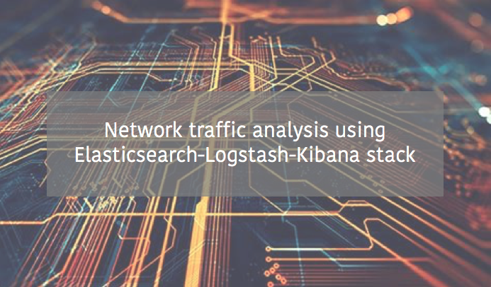</center>

# Network traffic analysis using Elasticsearch-Logstash-Kibana stack

Author : Simon Delarue  
Date : May 2021  

**Objective**

> The goal of this project is to provide a step by step tutorial to get one's hands on Elasticsearch-Logstash-Kibana (ELK) stack. For this purpose, we'll focus on the stack architecture and deployment first and latter on building a Kibana dashboard allowing user to analize internet network packets traffic.  

**Table of contents**  

1. [Environment](#environment)    
    1.1. [Virtualization](#virtualization)   
    2.1. [Workflow](#workflow)  
2. [ELK stack install](#install)  
    2.1 [Elasticsearch](#elasticsearch)  
    2.2 [Kibana](#kibana)  
    2.3 [Logstash](#logstash)  
    2.4 [PacketBeat](#packetBeat)  
3. [Data transfer in ELK](#data)  
    3.1 [Data pipeline](#pipeline)  
    3.2 [Index](#index)  
4. [Kibana dashboard](#kibana_dash)


&nbsp;
## 1. Environment <a class="anchor" id="environment"></a>

### 1.1 Virtualization <a class="anchor" id="virtualization"></a>  

An interesting approach to use ELK stack, is to go through a virtualized environment. Indeed, this allows to use a client-server architecture and thus to easily add traffics to analyse in the process if needed, as the whole ELK stack in hosted on a virtual machine.  

A quick way to create a virtual machine, is to instanciate one on [VirtualBox](https://www.virtualbox.org/wiki/Downloads). Here, I propose to install **Ubuntu 20.04.2.0** (available [here](https://ubuntu.com/download/desktop)) on this virtual machine.  

My own personnal machine configurations are as follow :
* MacOS (2011) : version 10.13.6 (High Sierra)
* RAM : 4GB 

The virtual machine's configurations are :
* Ubuntu 20.04.2.0  
* RAM : 2GB (dynamically provided by my own machine)  

Once the virtual machine is ready, with Ubuntu installed, we can go through ELK stack install.  
In order to get a better intuition on how ELK services are interacting with each others, I'll detail a **from-scratch** install.  


### 1.2 Workflow<a class="anchor" id="workflow"></a>

**Data**  

For this exercise, we'll use internet traffic packets from our own internet connexion. This allows to create a **dynamic** dashboard, updated in real time according to one's own actions on his machine. 

*Note : Another approach would be to analyse network traffic from `.pacp` files (i.e packet capture). These kind of files can be found on  [netresec website](https://www.netresec.com/?page=pcapfile) for example.*

**Architecture**  

As we saw earlier, the virtualized architecture has two sides :

1. **Client (Mac OS : 192.168.0.12)**  
  
  Here, only one client will be considered, the MacOS machine. To sniff the internet traffic on this machine, we'll install a specific service called [PacketBeat](https://www.elastic.co/fr/beats/packetbeat). PacketBeat is a _"lighweight network packet analyzer that sends data from your hosts [...] to Logstash or Elasticsearch"_. For a more industrial approach, i.e several machines on which an administrator would like to analyze the traffic simultaneously, each machine to be analyzed would have PacketBeat service installed, gathering traffic data and sending it to a centralized ELK stack in administrator server.    

2. **Server (Ubuntu : 192.168.56.108)**  

  ELK stack is installed on server side - i.e virtual machine - in order to gather all network traffic packets sent from clients (through PacketBeat services). The different tasks/applications hosted on server are :  
  - reading and preprocessing data from PacketBeat services, via a dedicated **log analysis tool** : [Logstash](https://www.elastic.co/fr/logstash)  
  - Storing preprocessed data on a **distributed analytics engine** : [Elasticsearch](https://www.elastic.co/fr/elasticsearch/)  
  - **Dynamic interface** providing users with the ability to search and visualize Elasticsearch data, thanks to custom dashboards : [Kibana](https://www.elastic.co/fr/kibana)

Below, the diagram for the client-server architecture for ELK stack : 

<center>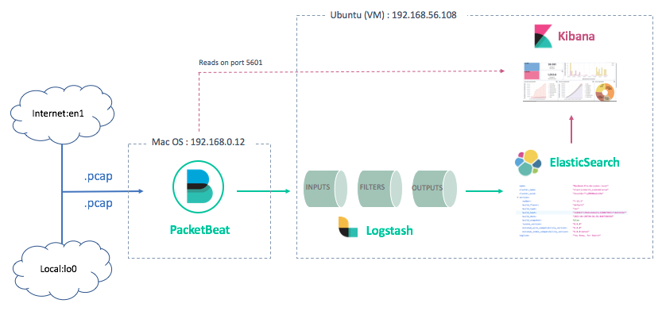</center>

&nbsp;
## 2. ELK stack install <a class="anchor" id="install"></a>

*Note : this install guide is essentially using ressources from [official ELK website](https://www.elastic.co/guide/en/elasticsearch/).*

In this chapter, we'll focus on installing the different services listed above. Then, in the next chapter, we'll go through the parameters customization to stick with the virtualized architecture.  
It is interesting to keep in mind that default parameters configuration for ELK stack allows user to work with the different services in local environment.  

### 2.1 Elasticsearch <a class="anchor" id="elasticsearch"></a>

To install and start **Elasticsearch** service, run the following commands in the virtual machine.

Get the public signature key and save the directory definition :
``` console
sudo apt-get install apt-transport-https

wget -qO - https://artifacts.elastic.co/GPG-KEY-elasticsearch | sudo apt-key add -

echo "deb https://artifacts.elastic.co/packages/7.x/apt stable main" | sudo tee /etc/apt/sources.list.d/elastic-7.x.list
```

Install and start Elasticsearch service :
``` console
sudo apt-get update && sudo apt-get install elasticsearch

sudo systemctl start elasticsearch
```

Open default Elasticsearch port, `9200` (optional) :
``` console
sudo firewall-cmd --add-port=9200/tcp --permanent

sudo firewall-cmd --reload
```
*Note : This step is optional if Elasticsearch service communicates only with services installed on the same machine (which is the case here, as the rest of ELK stack is installed on the virtual machine as well)*.

Verify connexion to Elasticsearch service with `curl` request on `9200` port
``` console
curl -X GET 'localhost:9200'
```
This command should return a message containing instance parameters values (see below) if everything went great during the install.
<center>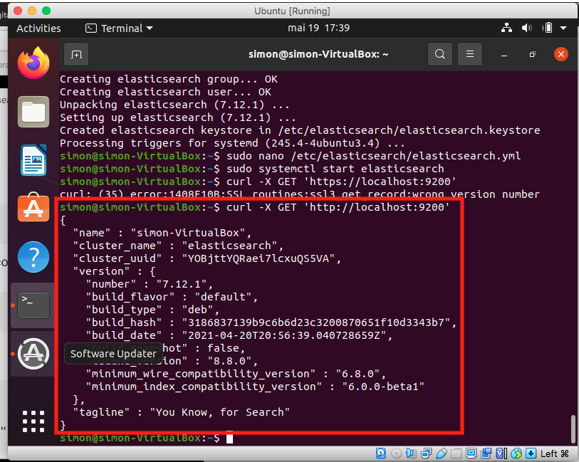</center>  

Geat, Elasticsearch service is now correctly installed !  

### 2.2 Kibana <a class="anchor" id="kibana"></a>  

Installing Kibana will be similar to what was done for Elasticsearch. On server-side (virtual machine) run the following commands.

Install Kibana service :
``` console
sudo apt-get update && sudo apt-get install kibana
```

Open Kibana default port, `5601` :
``` console
firewall-cmd --add-port=5601/tcp --permanent

firewall-cmd --reload
```

Even if Kibana default port is opened, at this stage, the service can only be reached on virtual machine's browser, at address `127.0.0.1:5601`. To allow the user to access his Kibana dashboard from a different machine, we'll need to customize Kibana configurations (see next chapter).

### 2.3 Logstash <a class="anchor" id="logstash"></a>  

Again, we'll install **Logstash** service on the virtual machine, with similar commands as what's been done in the previous steps.

Install Logstash service :
``` console
sudo apt-get update && sudo apt-get install logstash
```

Open Logstash default port, `5044` :
``` console
firewall-cmd --add-port=5044/tcp --permanent

firewall-cmd --reload
```

In order to check if Logstash install went well, we'll run a toy-pipeline and print the result in standard output. For this, run the following commands :
``` console
cd /usr/share/logstash

sudo bin/logstash -e 'input { stdin { } } output { stdout {} }'
```

This command wait for the user to type in a text and then print back Logstash packet details, containing the message provided by the user, as well as a timestamp for the packet.  

The result for the sentence "Hello Simon!" should be like this :
<p align="center">
    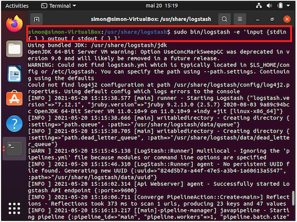
    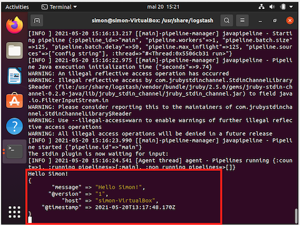
</p>

That's it, Logstash service is correctly installed !
Let's move on to the client side for the last install.

### 2.4 PacketBeat <a class="anchor" id="packetBeat"></a>

**PacketBeat** service is installed on client-side, as it is supposed to sniff the traffic on its host machine.  
As the client machine is running on MacOS, the install will be done through [Homebrew service](https://brew.sh/) (a useful package manager avaible on MacOS and Linux).

To install PacketBeat, run the following commands :
``` bash
simondelarue@MacBook-Pro-de-simon:~$ brew tap elastic/tap
simondelarue@MacBook-Pro-de-simon:~$ brew install elastic/tap/packetbeat-full

==> Installing packetbeat-full from elastic/tap
==> Downloading https://artifacts.elastic.co/downloads/beats/packetbeat/packetbeat-7.12.1-darwin-x86_64.tar.gz?tap=elastic/homebrew-tap
######################################################################## 100.0%
...
==> Summary
🍺  /usr/local/Cellar/packetbeat-full/7.12.1: 22 files, 102.7MB, built in 18 seconds
```
*Note : It is not necessary to install `libpcap` library on MacOS.*

Run the service and verify its status :
``` bash
simondelarue@MacBook-Pro-de-simon:~$ brew services start elastic/tap/packetbeat-full
==> Successfully started `packetbeat-full`

simondelarue@MacBook-Pro-de-simon:~$ brew services list
Name               Status  User         Plist       
packetbeat-full    started simondelarue /Users/simondelarue/Library/LaunchAgents/homebrew.mxcl.packetbeat-full.plist
```

Congratulations ! The service status is indeed `started`.   

As for the ELK stack install, default configurations only allow **local** running for the pipeline. As we installed ELK stack and PacketBeat on different machines, we now need to custom configurations to allow data to be processed through the entire pipeline.

&nbsp;
## 3. Data transfer in ELK <a class="anchor" id="data"></a>  

All the ELK stack services and PacketBeat have been correctly installed on both virtual machine and client machine. The following steps will detail how to configure these services in order to get them communicate between each other and to ship data from client-side to Kibana dashboard.  

We will be dealing with : 
* **PacketBeat** : in order to send client's sniffed data to Logstash, located on server-side.  
* **Logstash** : in order to receive sniffed data from PacketBeat and to preprocess it through a custom pipeline, before sending them to Elasticsearch service.  
* **Elasticsearch** and **Kibana** : in order give the services details about server's IP address. This step will be important for the ability of the user to access Kibana dashboard from a different machine than than the server.

### 3.1 Data pipeline <a class="anchor" id="pipeline"></a>

**PacketBeat**  

The PacketBeat configuration file, `packetbeat.yml` is located in `/usr/local/packetbeat` directory (client-side). This location depends on the installation of the service (in this case, via `Homebrew`).  

To modify this file, run the command : 
``` console
sudo nano /usr/local/etc/packetbeat/packetbeat.yml
```
and apply the following changes (usually by uncommenting/modifying the existing lines in the file) : 

- Define device to be sniffed. In this tutorial, it is our own internet traffic
``` yml
packetbeat.interfaces.device: en1
```
Note that all devices available can be listed with the command :
``` bash
packetbeat devices
```
- Define listening port for Kibana service (optional) (*) :
``` yml
setup.kibana:
  host: "192.168.56.108:5601"
```
- Define listening port for Logstash service (*):
``` yml
output.logstash:
  hosts: ["192.168.56.108:5044"]
```
_* 192.168.56.108 : ip address for server (see architecture diagram)_  

All other configurations are kept as provided by the install.

**Logstash**

In order to receive data from PacketBeat, preprocess them and send them to Elasticsearch, Logstash service will need 3 distinct new blocks :

* `input` : allowing to communicate with PacketBeat via deafault port : `5044`  

* `filter` : as an example in this tutorial, we'll use the `geoip` library to parse IP addresses into geolocation objects. This parsing is done on :
    * a specific field corresponding to **GPS location**
    * a custom error message if parsing failed

This `filter` step is particularly useful for visualizing network traffic on a map.

* `output` : allowing to communicate with Elasticsearch. As Logstash and Elasticsearch services are installed on the same virtual machine, default address for Elasticsearch service can be used : `localhost:9200`.  

To create these blocks, we **create a new configuration file** `pipeline.conf` in the install directory of Logstash service (server-side), containing all information detailed above. To do this, run these commands :

``` console
cd /usr/share/logstash

sudo touch pipeline.conf

sudo nano pipeline.conf 
```
Then modify `pipeline.conf` as follow :
``` bash
input {
    beats {
        port => "5044"
    }
}
filter {
    geoip {
        source => "[destination][ip]"
        tag_on_failure => ["geoip-destination-failed"]
    }
}
output {
    elasticsearch {
        hosts => [ "localhost:9200" ]
    }
}
```

After saving configuration file, let's run a test to check if Logstash service is going well with it :
``` console
sudo bin/logstash -f pipeline.conf --config.test_and_exit
...
Configuration OK
[INFO ] 2021-05-20 17:24:35.396 [logStash::Runner] runner - Using config.test_and_exit mode. Config Validation Result: OK. Exiting Logstash
```
The message returned by the service should look like the one above, with a nice "Configuration OK" printed on standard output.

If you want to run Logstash service with custom configuration file, and keep the service running and updating while modifying configurations (usefull when debugging), run the command :
``` console
sudo bin/logstash -f pipeline.conf --config.reload.automatic
```

After running this command, and if PacketBeat service is running, you should be able to get a message like the one below, telling you that your client network traffic packets are being processed by PacketBeat service to Logstash (located on server-side).

<center>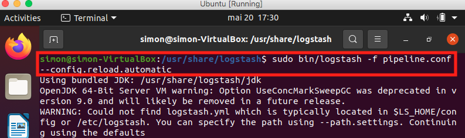</center>
<center>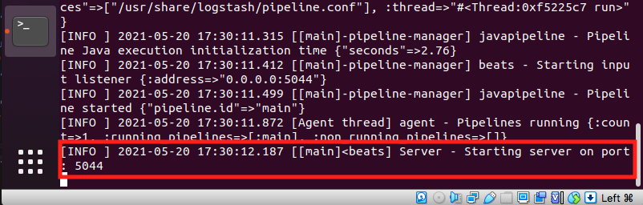</center>

Geat ! The first half of the pipeline is running well ! 
Let's build the second part, in order to send data to Kibana.

**Elasticsearch et Kibana**

To modify Elasticsearch and Kibana configuration, we'll use the `elasticsearch.yml` and `kibana.yml` files.

1. file `/etc/elasticsearch/elasticsearch.yml` : default values should be kept. Indeed, Logstash and Elasticsearch services are both communicating on the same machine.
``` yml
network.host: 127.0.0.1
http.port: 9200
```
2. file `/etc/kibana/kibana.yml` : Virtual machine's IP address is specified in Kibana's configuration file, as we will need to get access to Kibana dashboard from a different machine than the one hosting the service. Note that the `elasticsearch.hosts` can be used with local IP address, as the two services are both installed on the same machine.
``` yml
server.port: 5601
server.host: "192.168.56.108"
elasticsearch.hosts: ["http://127.0.0.1:9200"]
```

That's it !

Before sending data through the entire pipeline, we can connect to Kibana's web interface from the client side (MacOS), to check wether or not our configurations are properly understood by the service. To do this, go to the client-side browser and type in the following address : `192.168.56.108:5601`. This should displays Kibana's interface (see below) : 

<center>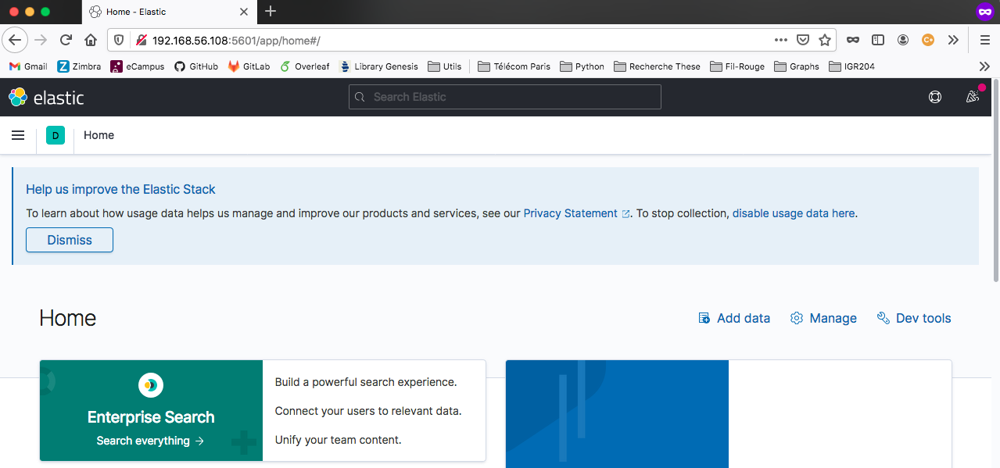</center>

*Note : You may have to open the page in a private browsing mode*.

The pipeline is running correctly ! Let's process our traffic packets through it, and manage the last few steps before dealing with Kibana dashboard.  

### 3.2 Index <a class="anchor" id="index"></a>  

The pipeline built for the different services of the ELK stack is now functional. When starting all of them on the different sides of the architecture, traffic network should be sniffed, sent to Logstash for parsing and then stored in Elasticsearch.  

To verify this, connect to Elastic "Index Management" page, by reaching Kibana's default port (from client side) : `192.168.56.108:5601`. If everything is correct, the result should show the data flow, with number of documents increasing over time :

<center>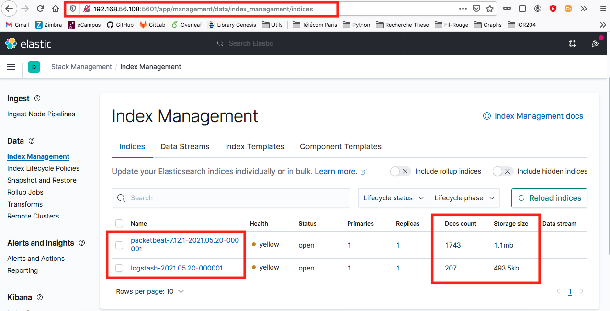</center>  

**Note** : In the image above, two data flows are being displayed ; `packetbeat-*` et `logstash-*`.   
- The first one (`packetbeat-*`) refers to a test architecture **without Logstash service**
- The second one (`logstash-*`) refers to the final architecture, **including Logstash service**  

This data flow is automatically indexed by an **index template for Logtstash**, available in Elasticsearch with default configurations. This index template comes in addition of the configuration file built for Logstash service, `pipeline.conf`. The **unique key** for indexing is a **TIMESTAMP** computed for each traffic packet. This allows to deal with dynamic data over time when using Kibana dashboard.  

Finally, in order to parse correctly **geolocation information**, built by Logstash service, it is essential to add a managing rule to the index template (`logstash-2021.05.20-000001`). This rule is built in Kibana's interface, in `devtools` section.

``` bash
PUT /logstash-2021.05.20-000001
PUT /logstash-2021.05.20-000001/_mapping
{
    "properties": {
        "geo": {
            "properties": {
                "location": {
                    "type": "geo_point"
                }
            }
        }
    }
}
```  


&nbsp;
## 4. Kibana dashboard <a class="anchor" id="kibana_dash"></a>  

Traffic packets have now been preprocessed and indexed. It is time to visualize them, using a **dynamic Kibana dashboard**.  

Below, a dashboard proposal that includes different kinds of lens/maps. This dashboard is automatically updated every 30 seconds.

<p align="center">
    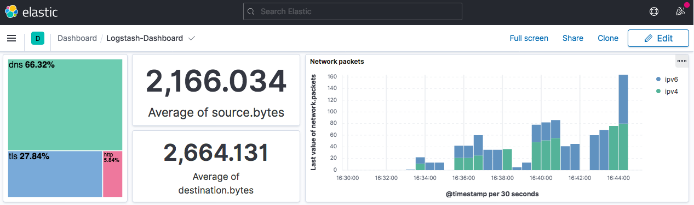
    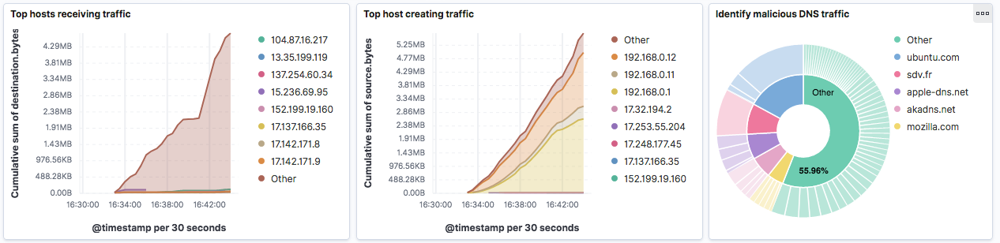
    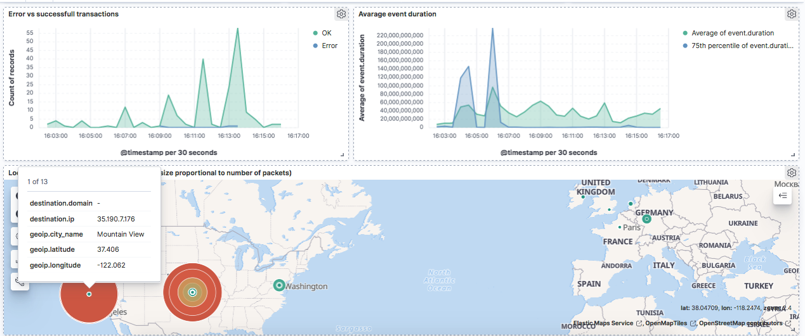
</p>

Several widgets are built in order to provide the user with the ability to analyse his own traffic from different points of view : 

* A **treemap** lens (top left), for quick filtering considering protocol being used in the traffic. User's choice (by clicking on the tree) forces the entire dashboard to be filtered and updated.  

* Two **information rectangles** that give the average volumes of incoming and created traffic. This gives the user a global idea about its traffic and may help to detect anomalies.

* A **barchart** (top right) with details about the number of packets sent, regarding their address type - **IPv4 or IPv6**.

* Two **graphs** displaying the **top IP addresses receiving and creating traffic**, in order to ensure that one IP address in particular would not be consuming a large share of the ressources. These graphs give a cumulated view about the traffic, which allows to detect long term anomalies rather than peaks in traffic.  

* A **piechart** on 2 levels, useful for **detecting potential malicious attacks** on a specific domain. Indeed, for each domain on the first level of the piechart (inside circle), are binded different requests created on them (outside circle). If a huge amount of request was about to happend on a specific domain, the user would immediatly see a very large amount of shares associated with this specific domain.  

* The **error transactions evolution**, which gives an idea about the amount of requests gone bad/good. 

* **Statistics about events duration**. These statistics give the user an order of magnitude of the response time for different requests on the network.  

* An **interactive map** locating destination IP addresses, with size and color marks proportionnal to the amount of packets sent to these locations. This map gives a great intuition about the geographic area affected by network traffic. _It is interesting to note that the client machine using MacOS and Mozilla Firefox is sending a lot of information to Mountain View, California, where Mozilla Foundation is based, and to Ninnescah, Kansas where Apple is locating some IP addresses._  

&nbsp;

> Congratulations for following this tutorial !